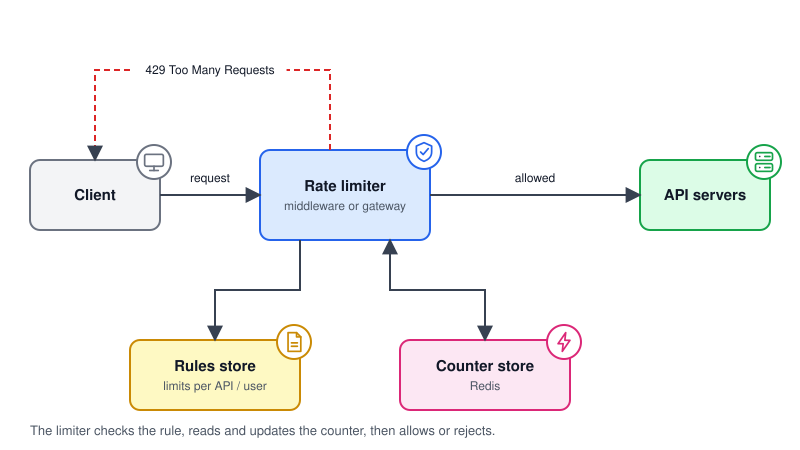
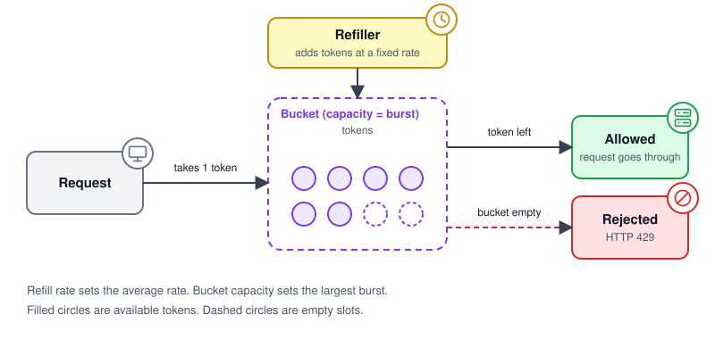
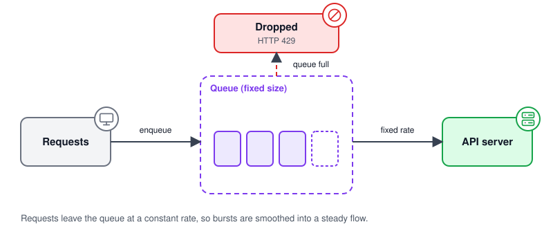
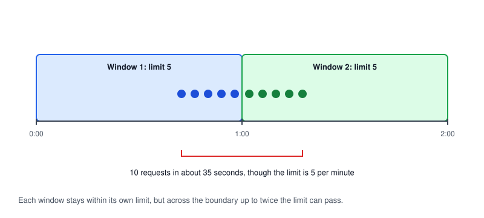
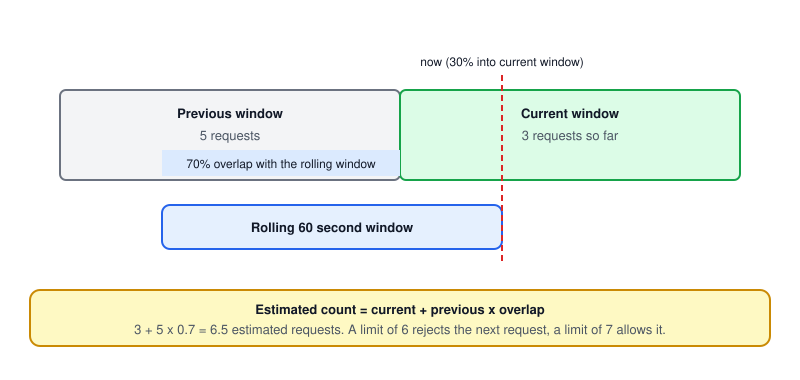
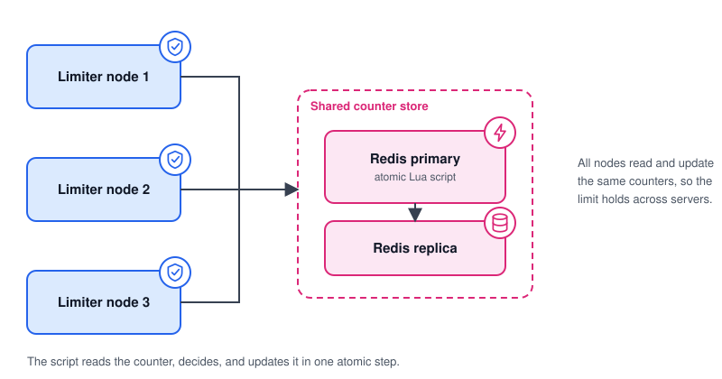

# Rate Limiter

## What it is

A rate limiter controls how many requests a client can send in a period of time. Requests under the limit pass through. Requests over the limit are rejected or delayed.

Typical rules look like "100 requests per minute per user" or "5 login attempts per 15 minutes per IP address".

## Why it matters

- **Protect availability:** one noisy client or a traffic spike should not take the service down.
- **Reduce abuse:** it slows brute force logins, scraping, and basic denial of service attempts. It is one layer, not a complete defense.
- **Control cost:** paid downstream calls, such as SMS or third-party APIs, stay within budget.
- **Share fairly:** every tenant gets a fair slice of capacity, and you can sell plans with different limits.

## Requirements to agree on first

Functional:

- Limit by user ID, API key, IP address, or endpoint.
- Support several rules at once, for example per user and per endpoint.
- Tell the client when it is limited and when to retry.

Non-functional:

- **Low latency:** the check runs on every request, so it must add very little time.
- **Accuracy:** the right requests are blocked, with a clearly stated tolerance.
- **Works across servers:** limits hold when many servers handle traffic.
- **Fault tolerant:** a failure in the limiter must not take the API down by accident.

## How it works

### Where to place it

- **Client side:** easy to bypass, so never rely on it alone.
- **Server side, in the application:** full control over rules, but every service must implement it.
- **Middleware or API gateway:** one shared place that protects all services. This is the usual choice. Managed gateways, such as Amazon API Gateway, include throttling.



*The limiter reads rules, updates a counter, then allows the request or returns HTTP 429.*

For each request the limiter does four things: identify the client, find the matching rule, check and update the counter, then allow or reject. Counters live in a fast in-memory store such as Redis, with a TTL (time to live) so old counters expire.

### Algorithms

Pick the algorithm based on how you want bursts handled.

#### 1. Token bucket

A bucket holds tokens up to a fixed capacity. Tokens are added at a steady rate. Each request takes one token. With no tokens left, the request is rejected.



*Refill rate sets the average. Capacity sets the largest burst.*

It can be stored per client as just a token count and a last refill time. Amazon API Gateway documents its throttling as a token bucket, where the rate is how fast tokens are added and the burst is the bucket capacity. AWS also describes these limits as targets, not guaranteed ceilings.

**Use it when:** short bursts are fine but the long-term average must stay bounded. It is widely used, for example in Amazon API Gateway.

#### 2. Leaky bucket

Requests enter a fixed size queue and are processed at a constant rate. When the queue is full, new requests are dropped.



*A queue smooths bursts into a steady outflow. Overflow is dropped.*

NGINX `limit_req` is documented as a leaky bucket. Its `burst` setting is how many excess requests may wait. Without `nodelay`, those requests are delayed to match the configured rate. With `nodelay`, they are served at once and requests beyond the burst are rejected. NGINX rejects with 503 by default, so set `limit_req_status 429` if you want 429.

**Use it when:** the backend needs a smooth, steady request rate. Avoid it when users need low latency during bursts, because requests wait in the queue.

#### 3. Fixed window counter

Time is split into fixed windows, such as one minute. Each window has a counter. The request is rejected once the counter passes the limit.



*Two windows meet at the boundary, so a client can send up to twice the limit within one window length.*

It is simple and uses very little memory. The weakness is the window edge. With a limit of 5 per minute, 5 requests at the end of one minute and 5 at the start of the next are all allowed, so 10 requests pass within a few seconds.

**Use it when:** approximate limits are acceptable, such as coarse daily quotas. Avoid it when strict short-term limits matter.

#### 4. Sliding window log

Store a timestamp for every request. For each new request, remove timestamps older than the window, then count what remains. Reject if the count is at the limit.

It is the most accurate option, and there is no boundary problem. The cost is memory, because it stores one entry per request. In Redis this is often built with a sorted set.

**Use it when:** limits are small and accuracy is critical, such as login attempts. Avoid it for high volume traffic.

#### 5. Sliding window counter

Keep a counter for the current and previous fixed windows. Estimate the rolling count as the current count plus the previous count weighted by how much of the previous window still overlaps.



*Example: 3 + 5 x 0.7 = 6.5 estimated requests in the last 60 seconds.*

It uses two counters per client and reduces the boundary problem of the fixed window. The result is an estimate, because it assumes requests were spread evenly in the previous window. In the example, a limit of 6 would reject the next request, and a limit of 7 would allow it.

**Use it when:** you want a good balance of accuracy and memory at high volume.

### Comparison

| Algorithm | Memory per client | Burst handling | Accuracy | Main drawback |
| --- | --- | --- | --- | --- |
| Token bucket | Very low | Allows bursts up to capacity | Good | Two parameters to tune |
| Leaky bucket | Low (queue size) | Smooths bursts | Good | Adds delay, old requests can block new ones |
| Fixed window | Very low | Allows double at the boundary | Low | Boundary spikes |
| Sliding window log | High | Strict | Exact | Memory grows with traffic |
| Sliding window counter | Very low | Mostly strict | Approximate | Estimate, not exact |

### What the client sees

Return **HTTP 429 Too Many Requests** (defined in RFC 6585). The RFC says the response may include a `Retry-After` header to say how long to wait. Some APIs also send `X-RateLimit-*` headers for the limit and remaining quota. GitHub's REST API does this and returns 403 or 429 when a limit is exceeded. These headers are a convention, not a standard. A standard version, `RateLimit` and `RateLimit-Policy`, was still an IETF Internet-Draft (version 11, May 2026) when this page was written, so check its status before relying on it.

RFC 6585 does not say how to identify a user or count requests. That is your design decision. Be careful with IP addresses, because many users can share one address behind a NAT (network address translation) or proxy.

### Rules

Keep rules in configuration, not code, and cache them in the limiter so changes do not need a deploy.

```yaml
- match: { endpoint: /login, key: ip }
  limit: 5
  window: 15m
- match: { endpoint: /api/*, key: user_id }
  limit: 1000
  window: 1h
```

### Making it work across servers



*Several limiter nodes read and update one shared counter store.*

Local counters on each node would let a client exceed the limit by spreading requests across nodes. Use a shared store, such as Redis.

- **Race conditions:** two nodes can read the same count, then both write. Avoid read-then-write from the app. `INCR` is atomic, but if you `INCR` and then `EXPIRE` as two separate calls, a crash in between leaves a key that never expires. The Redis docs fix this with `MULTI`/`EXEC` or a Lua script. Redis guarantees a script runs atomically, but it blocks the server while it runs, so keep scripts short.
- **Replication:** Redis replication is asynchronous by default, and the Redis docs say acknowledged writes can be lost on failover. A failover may therefore lose recent counts. For many rate limits this is acceptable, but decide on purpose.
- **Clocks:** use one time source, such as the store's time, so nodes do not disagree about window boundaries.
- **Multiple data centers:** a global exact limit needs cross-region coordination, which adds latency. Common approaches are a limit per region, or syncing counts asynchronously and accepting some overshoot.
- **Hot keys:** one very busy client always maps to one counter, so splitting data by key does not help that client. Spread different clients across nodes, for example with Redis Cluster, and consider a cheap local pre-check that rejects clearly abusive clients early.

### When the limiter fails

Decide this on purpose:

- **Fail open:** allow traffic if the counter store is down. This favors availability, but protection is gone.
- **Fail closed:** reject traffic. This favors protection, but a limiter outage becomes a full outage.

Failing open is a common choice for general API traffic, with alerts and a coarse local limit as a backstop. Consider failing closed for sensitive actions such as login or payments. This is a design decision, so weigh the cost of an outage against the cost of abuse.

### Monitoring

- Track allowed and rejected requests per rule and per client.
- Alert on a sudden rise in rejections, which can mean an attack or a limit set too low.
- Track limiter latency and counter store errors.
- Review rules regularly and adjust them with real data.

## Sizing with a back-of-the-envelope estimate

Work out how many counters you need, then measure the real cost.

- Assume 10 million active clients and one counter key per client.
- The Redis docs show that a tiny key with a short value takes about 56 bytes (Redis 7.2, 64-bit, jemalloc). Real keys have longer names, so they cost more.
- 10,000,000 x 56 bytes is about 0.56 GB, so plan for at least that much, and more for longer keys.
- A sliding window log stores one entry per request, so it grows with traffic.

Use `MEMORY USAGE <key>` on your own keys to get the real number before you size the store.

## Trade-offs

| Choice | Gain | Cost |
| --- | --- | --- |
| Gateway placement | One place to enforce rules | Another component on the request path |
| Shared Redis store | Accurate limits across servers | Network hop per request and a dependency to run |
| Strict accuracy | Fewer overshoots | More memory and more coordination |
| Fail open | API stays available | No protection while the limiter is down |
| Per IP limits | Works without login | Unfair to users sharing an IP |

## Common mistakes

- Relying on client-side limits.
- Limiting only by IP and blocking whole offices or mobile networks.
- Read-then-write counters without atomic operations.
- Returning 429 without `Retry-After`, so clients retry immediately and make it worse.
- No plan for what happens when the counter store is down.

## When to use it

Add a rate limiter to any public or multi-tenant API. Start with a gateway level token bucket or sliding window counter, per API key or user ID. Add stricter, endpoint specific limits for login, password reset, and other sensitive actions. It does not replace authentication, input validation, or a web application firewall.

## References

- Alex Xu, *System Design Interview: An Insider's Guide*, Chapter 4, for the original walkthrough this page is based on.
- [System Design Notes, 04. Rate Limiter](https://github.com/liquidslr/system-design-notes/blob/main/04.%20Rate%20Limiter/Readme.md) by liquidslr, a community summary of the same chapter.
- [RFC 6585, section 4: 429 Too Many Requests](https://www.rfc-editor.org/rfc/rfc6585#section-4)
- [IETF draft: RateLimit header fields for HTTP](https://datatracker.ietf.org/doc/draft-ietf-httpapi-ratelimit-headers/)
- [Amazon API Gateway: request throttling](https://docs.aws.amazon.com/apigateway/latest/developerguide/api-gateway-request-throttling.html) for token bucket throttling.
- [NGINX ngx_http_limit_req_module](https://nginx.org/en/docs/http/ngx_http_limit_req_module.html) for leaky bucket request limiting.
- [Redis: scripting with Lua](https://redis.io/docs/latest/develop/programmability/eval-intro/) for atomic script execution.
- [Redis INCR: rate limiter pattern](https://redis.io/docs/latest/commands/incr/) for atomic counters and the INCR/EXPIRE race.
- [Redis replication](https://redis.io/docs/latest/operate/oss_and_stack/management/replication/) for asynchronous replication and failover data loss.
- [Redis MEMORY USAGE](https://redis.io/docs/latest/commands/memory-usage/) for measuring key size.
- [GitHub REST API: rate limits](https://docs.github.com/en/rest/using-the-rest-api/rate-limits-for-the-rest-api) for an example of `x-ratelimit-*` headers.

All diagrams in this topic are original and live in [`images/`](images/).
