# Zero to Millions of Users

## What it is

Scaling is the practice of growing a system in small, measured steps so it keeps working as traffic grows. Almost no product starts with millions of users. It usually starts on one server and evolves, one bottleneck at a time.

This page walks through that evolution in the order most real systems follow. Each step names the problem it solves and the cost it adds.

## Why it matters

Knowing the order tells you what to add, and what to leave out. Over-building early wastes money and adds failure modes. Under-building causes outages when traffic spikes. The same sequence is a common starting point in system design interviews.

## The journey at a glance

| Stage | Typical trigger | Main fix |
| --- | --- | --- |
| Single server | Launch | Keep it simple |
| Separate web and data tiers | Web and database compete for CPU and memory | Move the database to its own server |
| Multiple web servers | One server is a capacity limit and a single point of failure | Load balancer and a stateless web tier |
| Read-heavy database | Reads dominate and the database is slow | Replicas and a cache |
| Global users | High latency for distant users, heavy static traffic | CDN, then multiple data centers |
| Slow background work | Emails, images, and reports block requests | Message queue and workers |
| Very large data | One primary cannot hold or write all the data | Sharding |
| Operating at scale | Incidents are hard to find and deploys are risky | Logging, metrics, tracing, automation |

## How it works

### 1. Single server

Everything runs on one machine: web app, database, and cache. This is the right starting point.

1. The user enters a domain name. DNS (the Domain Name System) returns the server IP address.
2. The client sends an HTTP request to that IP.
3. The server returns HTML for web clients or JSON for mobile clients.

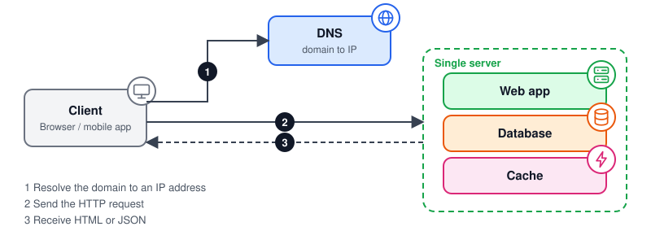

*A client resolves the domain, then talks to one server that runs everything.*

**Use it when:** you are launching, validating the idea, or have low traffic. Skip it when downtime is unacceptable.

### 2. Separate the web tier and data tier

Move the database to its own server. The two tiers no longer compete for resources, and each can scale, fail, and be secured on its own.

Choosing a database:

- **Relational (SQL)**, such as MySQL or PostgreSQL, fits structured data, joins, and transactions. It is the safe default.
- **Non-relational (NoSQL)**, such as key-value, document, column, or graph stores, can fit very low latency, flexible schemas, or huge volumes. Many trade joins or strict consistency for scale and flexibility, but this varies by product, so check the documentation of the one you pick.

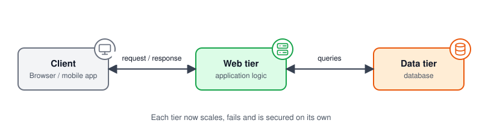

*The web tier and the database now run independently.*

**Use it when:** the web app and database compete for CPU or memory, or you need different security rules and scaling for each.

### 3. Vertical and horizontal scaling

- **Vertical scaling (scale up)** adds CPU or RAM to one machine. It is simple, but it has a hardware ceiling and leaves a single point of failure.
- **Horizontal scaling (scale out)** adds more machines. It needs a load balancer and stateless servers, but it has a much higher ceiling and can tolerate individual server failures.

Scale up first while it is cheap and easy. Plan to scale out before you hit the ceiling.

**Use it when:** scale up for a quick, cheap win at low traffic. Scale out when you near the hardware limit or need failover.

### 4. Load balancer

A load balancer accepts all user traffic and spreads it across web servers. Servers sit on a private network, so users only see the public IP of the balancer.

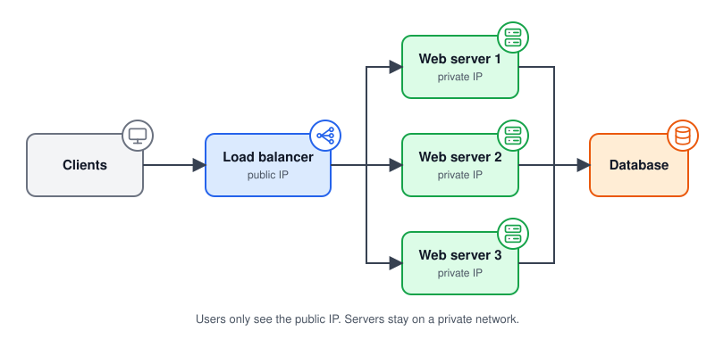

*The load balancer routes each request to a healthy server.*

It removes the web tier as a single point of failure. The balancer needs redundancy too, usually an active and a standby pair, or a managed service.

**Use it when:** you run more than one web server, or one server is a capacity limit or single point of failure.

### 5. Make the web tier stateless

A stateful server keeps session data in its own memory, so a user must return to the same server (often called sticky sessions). This makes load balancing and auto scaling harder.

Store sessions in a shared store, such as Redis or a NoSQL database. Then any server can handle any request, and servers can be added or removed freely.

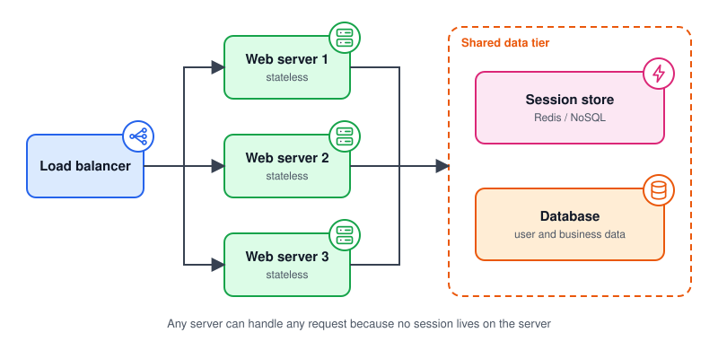

*Sessions live in a shared data tier, not on the web servers.*

**Use it when:** you want auto scaling or a load balancer that can send any request to any server. Do it before adding servers.

### 6. Database replication

Replication keeps copies of the data on several database servers.

- The **primary** accepts writes.
- **Replicas** (PostgreSQL calls them standbys) copy the primary and can serve read-only queries.

Most apps read far more than they write, so replicas add read capacity. They also add resilience:

- If a replica fails, reads move to other replicas or to the primary.
- If the primary fails, a replica can be promoted. This needs care. With asynchronous replication, transactions not yet copied to the replica can be lost. Synchronous replication reduces that risk but adds write latency.

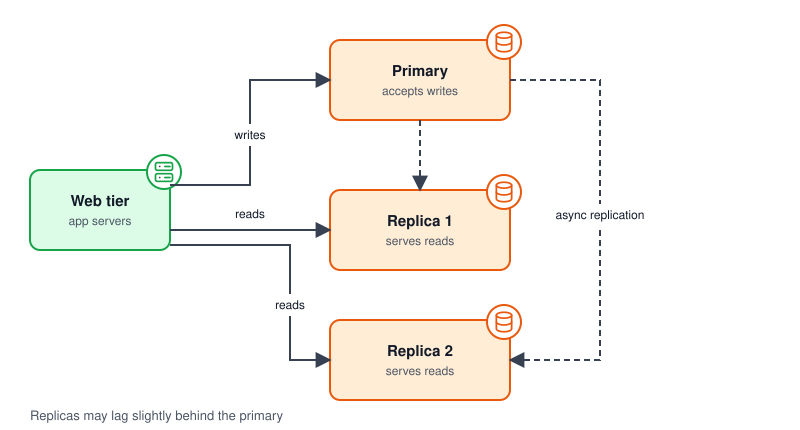

*Writes go to the primary. Reads are spread across replicas.*

**Use it when:** reads far outnumber writes, the primary is overloaded by reads, or you need failover. It does not help write-heavy load.

### 7. Cache

A cache keeps hot data in memory, which is far faster than a database query. The common approach is **cache aside**, which AWS ElastiCache documents as lazy loading. Check the cache. On a miss, read the database, then store the result in the cache. The first read of each item is slower because a miss costs three steps: a cache read, a database read, and a cache write.

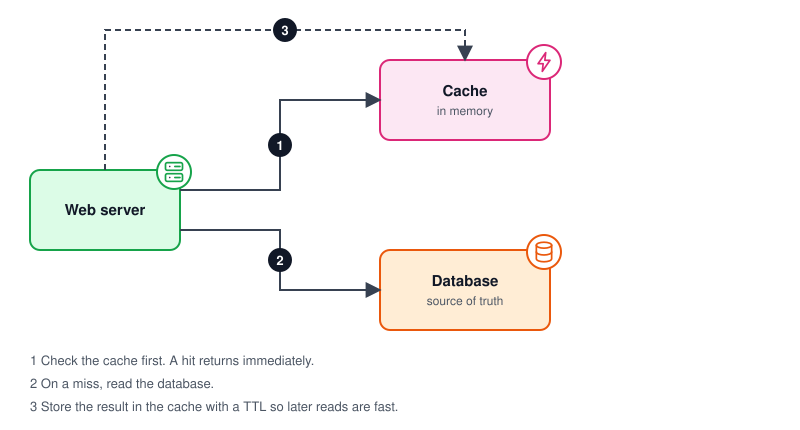

*The web server checks the cache first and falls back to the database.*

Decisions to make:

- **Expiration:** set a TTL (time to live) so entries expire. A TTL limits how stale data can get but does not guarantee freshness.
- **Consistency:** decide how updates reach the cache. Invalidate on write, or accept short staleness.
- **Eviction:** use a policy such as LRU (least recently used) when memory is full.
- **Failure:** run more than one cache node, and make sure the database can survive a cold cache.

**Use it when:** data is read often, changes rarely, and is costly to compute or fetch. Avoid it for data that must always be fresh.

### 8. Content delivery network (CDN)

A CDN stores copies of static files, such as images, CSS, and JavaScript, on servers around the world. Users download from the nearest location, which cuts latency and offloads your servers.

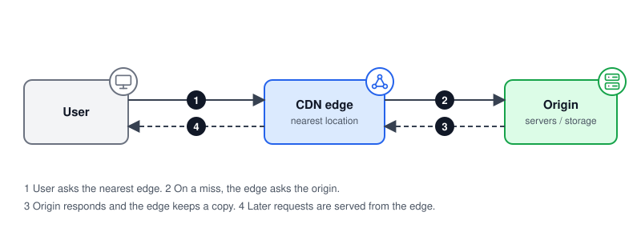

*The edge serves cached files and only calls the origin on a miss.*

Plan for cost and a sensible cache expiry. For files that change often, AWS CloudFront recommends versioned file names over invalidation, because it is cheaper and avoids users seeing old copies. Also plan how the site behaves if the CDN is unavailable.

**Use it when:** you serve static files to users in many regions, or static traffic is loading your servers.

### 9. Message queue

Some work does not need to finish inside the request, such as sending email, resizing images, or building reports. A message queue lets producers publish tasks, and workers process them later.

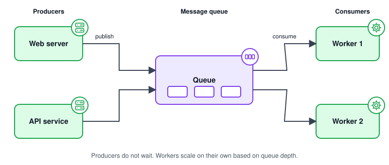

*Producers publish and move on. Workers consume at their own pace.*

This smooths traffic spikes and lets each side scale on its own. Workers should be idempotent (safe to run twice). For example, Amazon SQS standard queues deliver at least once, so a message can arrive more than once or out of order.

**Use it when:** work can finish after the response, traffic comes in spikes, or a slow dependency should not block users.

### 10. Multiple data centers

Running in more than one data center, or cloud region, improves availability and lowers latency for distant users. DNS routing, such as geolocation or latency-based routing, sends each user to a suitable location. With health checks and failover configured, traffic moves to another site if one fails. The closest site by distance is not always the fastest.

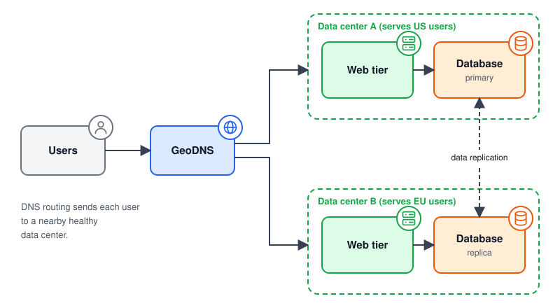

*DNS routing sends users to a nearby healthy data center. Data is replicated between sites.*

The hard part is data. You must replicate across sites, decide how conflicting writes are handled, and keep deployments consistent with automation.

**Use it when:** you need regional failover, or users far from your region see high latency. The data sync cost is high, so do not start here.

### 11. Shard the database

When one primary can no longer hold or write all the data, split it with **sharding**. Each shard holds part of the data, chosen by a sharding key such as `user_id`.

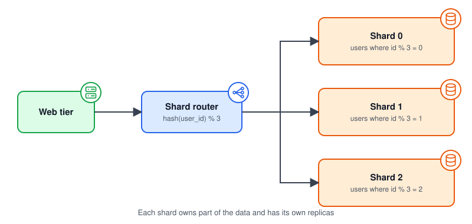

*A router maps each user to one shard.*

Common challenges:

- **Key choice:** a poor key creates uneven shards. Pick one that spreads data and load evenly.
- **Resharding:** moving data when shards fill up is costly. Consistent hashing reduces the movement.
- **Hot keys:** a celebrity account can overload one shard. Give it a dedicated shard or cache it heavily.
- **Joins and transactions:** these become hard across shards. De-normalize or redesign queries to stay within one shard.

Shard late. Try caching, replicas, and query tuning first.

**Use it when:** data or write volume has outgrown one primary, even after replicas, caching, and query tuning.

### 12. Logging, metrics, tracing, and automation

At scale you cannot fix what you cannot see.

- **Logs** are timestamped messages emitted by services and components.
- **Metrics** are numeric measurements aggregated over time, such as error rate, CPU use, request rate, and queue depth.
- **Traces** record the path of a single request across services, which helps find slow parts and root causes.
- **Automation** covers testing, deployment, and scaling, so releases are safe and repeatable.

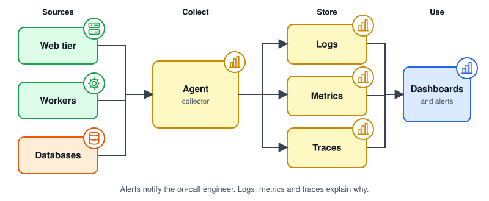

*Telemetry flows from every tier into dashboards and alerts.*

**Use it when:** from the start. Basic logs and metrics on day one, tracing and automated deploys once you have several services.

## The combined architecture

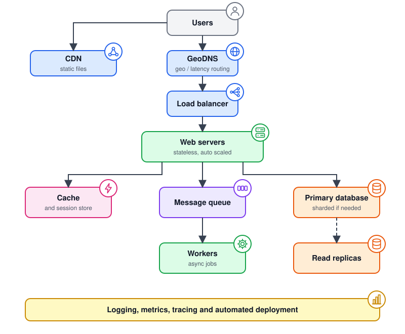

*All the pieces together. Not every system needs every box.*

## Sizing with a back-of-the-envelope estimate

Estimate before you add components. These numbers are illustrative.

- 1 million daily active users, 20 requests each: 20 million requests per day.
- 20,000,000 / 86,400 seconds is about 230 requests per second on average.
- Peak is often 2 to 3 times the average, so plan for roughly 500 to 700 requests per second.
- Depending on the workload, one well-tuned server may handle that for simple requests. Measure your own workload.

The lesson: at this size the drivers are usually **availability, data growth, and latency**, not raw request rate. Always check which one is actually your bottleneck.

## Failure and reliability checklist

Walk each tier and ask what happens when it fails.

- Is there more than one of each component, including the load balancer?
- Can a replica be promoted, and how much data might be lost?
- What happens to the database if the cache is empty?
- Do queue consumers handle duplicates and poison messages?
- Can you fail over to another data center, and have you tested it?
- Are backups taken, and have you tried a restore?

## Security basics at each tier

- Keep web servers and databases on private networks. Expose only the load balancer.
- Use HTTPS everywhere and encrypt data at rest.
- Add rate limiting and basic abuse protection at the edge.
- Give each service the minimum database permissions it needs.

## Trade-offs

| Step | Gain | Cost |
| --- | --- | --- |
| Load balancer | Availability and capacity | One more component that also needs redundancy |
| Stateless web tier | Easy scaling and recovery | Needs a shared session store |
| Replication | Read capacity and failover | Replica lag and stale reads |
| Cache | Low latency and less database load | Stale data and invalidation logic |
| CDN | Fast static delivery | Provider cost and cache invalidation |
| Message queue | Decoupling and spike smoothing | Async complexity and eventual results |
| Multiple data centers | Resilience and lower latency | Data sync and higher operating effort |
| Sharding | Horizontal scale for data and writes | Resharding, hot shards, and no easy joins |

## Common mistakes

- Sharding or adding microservices before measuring a real bottleneck.
- Storing sessions on web servers, then struggling to scale out.
- Caching without a TTL or an invalidation plan.
- Treating the load balancer or cache as if it cannot fail.
- Skipping metrics and alerts until the first major outage.

## When to use what

Do not build all of this on day one. Add a step only when measurements show a bottleneck that it solves. Each step above ends with its own "Use it when" line.

1. Keep the web tier stateless.
2. Build redundancy at every tier.
3. Cache data and serve static files from a CDN.
4. Move slow work to queues.
5. Add data centers for availability and latency, with tested failover.
6. Shard the data tier only when one primary is not enough.
7. Invest in observability and automation early.

## References

- Alex Xu, *System Design Interview: An Insider's Guide*, Chapter 1, for the original walkthrough this page is based on.
- [System Design Notes, 01. Scaling](https://github.com/liquidslr/system-design-notes/blob/main/01.%20Scaling/Readme.md) by liquidslr, a community summary of the same chapter.
- [PostgreSQL documentation: log-shipping standby servers](https://www.postgresql.org/docs/current/warm-standby.html) for primary, standby, and asynchronous vs synchronous replication.
- [Amazon ElastiCache: caching strategies](https://docs.aws.amazon.com/AmazonElastiCache/latest/dg/Strategies.html) for lazy loading, write-through, and TTL.
- [Amazon CloudFront: invalidation and versioned file names](https://docs.aws.amazon.com/AmazonCloudFront/latest/DeveloperGuide/Invalidation.html) for updating cached content.
- [Amazon SQS standard queues](https://docs.aws.amazon.com/AWSSimpleQueueService/latest/SQSDeveloperGuide/standard-queues.html) for at-least-once delivery.
- [Amazon Route 53 routing policies](https://docs.aws.amazon.com/Route53/latest/DeveloperGuide/routing-policy.html) for geolocation, latency, and failover routing.
- [OpenTelemetry observability primer](https://opentelemetry.io/docs/concepts/observability-primer/) for logs, metrics, and traces.
- [AWS Well-Architected Framework](https://aws.amazon.com/architecture/well-architected/) for reliability and performance guidance.
- [Google SRE Book](https://sre.google/sre-book/table-of-contents/) for monitoring and reliability practice.
- Martin Kleppmann, [*Designing Data-Intensive Applications*](https://dataintensive.net/) for replication, partitioning, and consistency.

All diagrams in this topic are original and live in [`images/`](images/).
